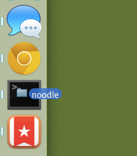
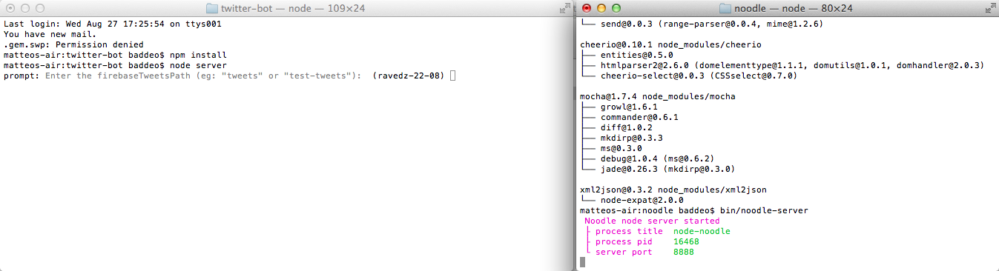

#Hello human!

What's this *bot* in a nutshell? 

* Configurable Twitter-scraper: filter by #hashtag and/or @username
* Archive tweets w/ pictures, links, mentions, hashtags & geodata to a [Firebase](https://www.firebase.com/) database (but it could be any db that accepts JSON)
* Twitter-bot to reply/poke players (be careful though, Twitter may suspend your account if you abuse this feature)

##Requirements

* [Node.js](http://nodejs.org/download/) installed on the machine where you're going to run the bot
* [Noodle.js](http://noodlejs.com/#download) installed and running on the same machine (Noodle is used to scrape Twitter, bypassing the restrictions of the Twitter API)
* A [Firebase app](https://www.firebase.com/account/) ready to accept data
* To have the *bot* sending out tweets, you'll need an *app* from [https://apps.twitter.com/](https://apps.twitter.com/) which provides the authentication keys required

#### Step 1 → Installing Node.js
1. To start, make sure you have **Node.js** installed ([download it here](http://nodejs.org/download/)), 
2. Install **npm** ([follow these instructions](http://blog.nodejitsu.com/npm-cheatsheet/#Installing_npm)).

#### Step 2 → Installing Noodle

1. Open Terminal (or the equivalent command-line tool for Windows) 
2. Navigate to this project's folder (on a Mac, you can do that by dragging a folder onto the Terminal icon in the dock)
5. Type in `git clone https://github.com/dharmafly/noodle.git` and press *Enter* to run the command
6. `cd noodle`
7. `npm install` (You may have to use `sudo npm install` if you get errors)
8. `bin/noodle-server` to start the Noodle server

#### Step 3 → Installing the *bot*
1. Open a **new Terminal window** (or the equivalent command-line tool for Windows) and navigate to this project's folder 
2. `npm install` to install the necessary node_modules ([learn more about Node.js modules](http://nodejs.org/docs/v0.4.1/api/modules.html))
5. `node server` to start the *bot*

You will end up with two Terminal windows: one running the *bot*, and the other running *Noodle* (see below).

##Configuring the Twitter bot

1. Open `/js/libraries/twitter.auth.js`
2. Make sure that the API key, API secret, Access token and Access token secret are set correctly in *exports.auth*
2. If necessary change the value of the *text* string in *exports.testTweet* so that it contains a @twitterName that you can check, and remember to save your edits
3. Open Terminal (or the equivalent command-line tool for Windows) and navigate to this project's folder
5. `node tweet` to test the Twitter bot

###Troubleshooting

1. The bot doesn't have permissions to write on behalf of @RaveBaseCamp, so you get this error

        { [Error: HTTP Error 401: Unauthorized, API message: {"request":"\/1.1\/statuses\/update.json","error":"Read-only application cannot POST."}] data: '{"request":"\\/1.1\\/statuses\\/update.json","error":"Read-only application cannot POST."}', statusCode: 401 } 
   
   Go to https://apps.twitter.com/app/6575811/keys and make sure that `Access level` is set to 	`Read, write, and direct messages` for both *Application settings* and *Your access token*
   
2. The bot can't post the same text of a previous tweet, so you get this error

        { [Error: HTTP Error 403: Forbidden, API message: {"errors":[{"code":187,"message":"Status is a duplicate."}]}]  data: '{"errors":[{"code":187,"message":"Status is a duplicate."}]}', statusCode: 403 }
        
   Open `/js/libraries/twitter.auth.js` and change the value of the *text* string in *exports.testTweet*
     

